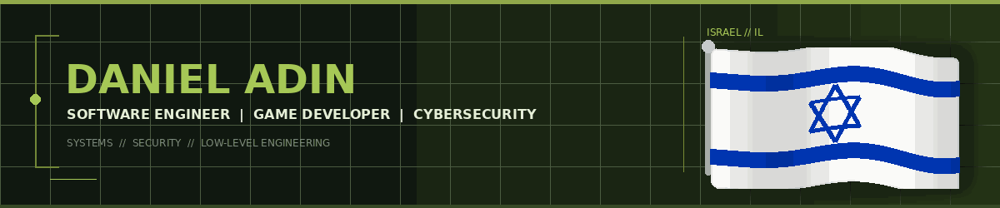

<!--
  MasterChiefProject profile README
  Futuristic tactical-HUD presentation.
  Dynamic images are rendered by public README widget services and require no custom GitHub Actions.
-->

<div align="center">


<a href="https://github.com/MasterChiefProject">
  
</a>


<br/>


</div>

```text
╔══════════════════════════════════[ MISSION PROFILE ]══════════════════════════════════╗
║  ENGINEER   Daniel Adin                                                            ║
║  SPECIALTY  Systems • Security • Game Development • Low-Level Engineering          ║
║  DIRECTIVE  Understand complex software deeply, then build it better.              ║
╚═══════════════════════════════════════════════════════════════════════════════════════╝
```

Computer Science graduate and active programmer focused on technically challenging software.

My work spans **systems programming, cybersecurity, game development, reverse engineering, networking, Windows internals, full-stack development, architecture, debugging, and performance engineering**. I am especially interested in understanding how complex software behaves internally and in building systems from the ground up.

---

## `01 // SYSTEM LOADOUT`

<div align="center">

### Core Languages


<br/><br/>

### Engineering Platforms


<br/>
</div>

<details>

<summary><b>CYBER / REVERSE-ENGINEERING TOOLCHAIN</b></summary>
<br/>

`IDA Pro` · `Ghidra` · `WinDbg` · `x64dbg` · `Spartacus` · `Kali Linux` · `System Informer` · `WinObj` · `Procmon` · `VirtualBox` · `VMware` · `Cheat Engine` · `ReGenny` · `ReClass` · `HxD` · `dnSpy` · `Agent Ransack`

</details>

<details>
<summary><b>GAME DEVELOPMENT TOOLCHAIN</b></summary>
<br/>

`Godot` · `Unreal Engine` · `Unity` · `CryEngine` · `Roblox` · `Blender` · `FModel` · `UAssetGUI` · `UModel`

</details>

<details>
<summary><b>SOFTWARE DEVELOPMENT TOOLCHAIN</b></summary>
<br/>

`Git` · `GitHub` · `Visual Studio` · `Visual Studio Code` · `Lazarus` · `NASM` · `Notepad++` · `ChatGPT` · `Gemini` · `Qwen`

</details>

---

## `02 // PUBLIC OPERATIONS`

<table>
<tr>
<td width="50%" valign="top">

<h3>SigmaTokens</h3>
<p><strong>CYBER // HONEYTOKEN DEFENSE PLATFORM</strong></p>
<p>Central manager and endpoint-agent system for deploying and monitoring decoy assets, coordinating agents, and generating alerts when honeytokens are accessed.</p>

<a href="https://github.com/SigmaTokens"></a>
<a href="https://github.com/SigmaTokens/Sigma-Manager"></a>
<a href="https://github.com/SigmaTokens/Sigma-Agent"></a>

</td>
<td width="50%" valign="top">

<h3>RGBQuest</h3>
<p><strong>UNITY // FIRST-PERSON PUZZLE ADVENTURE</strong></p>
<p>Three-stage Unity 6 adventure combining RGB cube physics, pressure-plate puzzles, portals, combat, pickups, and NavMesh-driven ghosts.</p>

<a href="https://masterchiefproject.github.io/RGBQuest/"></a>
<a href="https://github.com/MasterChiefProject/RGBQuest"></a>

</td>
</tr>

<tr>
<td width="50%" valign="top">

<h3>KnightCookie</h3>
<p><strong>JAVASCRIPT // DETERMINISTIC MAZE ADVENTURE</strong></p>
<p>Hidden encounters, collectible upgrades, automatic combat, deterministic game logic, persistent browser saves, and automated rules testing.</p>

<a href="https://masterchiefproject.github.io/KnightCookie/"></a>
<a href="https://github.com/MasterChiefProject/KnightCookie"></a>
<a href="https://www.linkedin.com/posts/colmandevclub_preview-ugcPost-7019324923282108416-8BDd"></a>

</td>
<td width="50%" valign="top">

<h3>Nightmaze</h3>
<p><strong>UNITY // ESCAPE HORROR</strong></p>
<p>First-person escape-horror game with traps, portals, moving platforms, environmental audio, and scene-based death and victory flow.</p>

<a href="https://masterchiefproject.github.io/Nightmaze/"></a>
<a href="https://github.com/MasterChiefProject/Nightmaze"></a>

</td>
</tr>

<tr>
<td width="50%" valign="top">

<h3>Realmaze</h3>
<p><strong>UNITY // EXPLORATION &amp; ESCAPE</strong></p>
<p>First-person outdoor maze with collectible-driven progression, hostile zombies, gated objectives, and a performance-tuned WebGL deployment.</p>

<a href="https://masterchiefproject.github.io/Realmaze/"></a>
<a href="https://github.com/MasterChiefProject/Realmaze"></a>

</td>
<td width="50%" valign="top">

<h3>Scrabble</h3>
<p><strong>JAVA // MULTIPLAYER WORD ENGINE</strong></p>
<p>Java 17 Scrabble engine with multiplayer rules, board and scoring validation, dictionary checks, a TCP dictionary service, and a browser-playable adaptation.</p>

<a href="https://masterchiefproject.github.io/Scrabble/"></a>
<a href="https://github.com/MasterChiefProject/Scrabble"></a>

</td>
</tr>
</table>

---

## `03 // CLASSIFIED PROGRAM`

> [!NOTE]
> **MasterCheats** is a private modding project focused on experimental mod menus and private-server tooling for video games.

<a href="https://github.com/Master-Cheats"></a>

---

## `04 // SYSTEM TELEMETRY`

<div align="center">


<br/><br/>


<br/><br/>

<a href="https://github.com/MasterChiefProject?tab=repositories">
  
</a>
<a href="https://github.com/MasterChiefProject">
  
</a>

</div>

---

## `05 // EDUCATION & RECORDS`

<div align="center">


<br/>

<table>
<tr>
<td align="center" width="28%">
<sub>CREDENTIAL</sub><br/>
<strong>B.Sc. Computer Science</strong>
</td>
<td align="center" width="24%">
<sub>INSTITUTION</sub><br/>
<strong>Colman</strong>
</td>
<td align="center" width="16%">
<sub>COMPLETED</sub><br/>
<strong>2026</strong>
</td>
<td align="center" width="32%">
<sub>DOCUMENTS</sub><br/><br/>
<a href="docs/computer_science_bsc_degree_certificate.pdf">
  
</a>
<a href="docs/computer_science_bsc_degree_record_of_studies.pdf">
  
</a>
</td>
</tr>

<tr>
<td align="center" width="28%">
<sub>SERVICE RECORD</sub><br/>
<strong>Israel Defense Forces</strong>
</td>
<td align="center" width="24%">
<sub>SERVICE</sub><br/>
<strong>Military Service</strong>
</td>
<td align="center" width="16%">
<sub>STATUS</sub><br/>
<strong>Honorable Discharge</strong>
</td>
<td align="center" width="32%">
<sub>DOCUMENT</sub><br/><br/>
<a href="docs/idf_certificate_of_honorable_discharge.pdf">
  
</a>
</td>
</tr>

<tr>
<td align="center" width="28%">
<sub>CREDENTIAL</sub><br/>
<strong>Full Israeli Bagrut</strong>
</td>
<td align="center" width="24%">
<sub>TRACK</sub><br/>
<strong>Technology / Science</strong>
</td>
<td align="center" width="16%">
<sub>COMPLETED</sub><br/>
<strong>2019</strong>
</td>
<td align="center" width="32%">
<sub>DOCUMENTS</sub><br/><br/>
<a href="docs/bagrut_certificate.pdf">
  
</a>
<a href="docs/bagrut_record_of_studies.pdf">
  
</a>
</td>
</tr>
</table>

<br/><br/>

<sub>PROFESSIONAL DOCUMENT</sub><br/><br/>

<a href="docs/daniel_adin_resume.pdf">
  
</a>

</div>

---

## `06 // COMMS`

<div align="center">


<br/>

<table>
<tr>
<td align="center" width="50%">
<sub>PROFESSIONAL CHANNEL</sub><br/><br/>
<a href="https://www.linkedin.com/in/masterchiefproject">
  
</a>
</td>
<td align="center" width="50%">
<sub>DIRECT CHANNEL</sub><br/><br/>
<a href="mailto:adin.daniel@cs.colman.ac.il">
  
</a>
</td>
</tr>
</table>

<br/>


<br/><br/>


</div>
